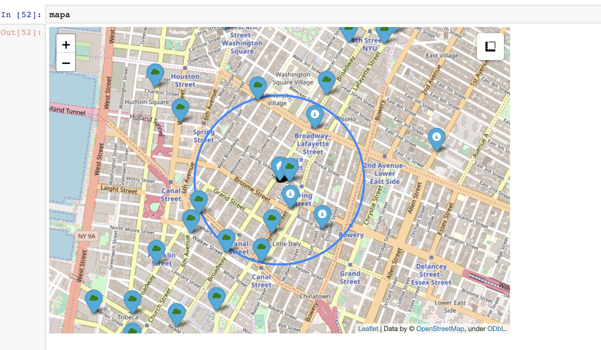

# ¿Donde construir tu empresa? 
Esa fue la pregunta con la que comezó este proyecto. Con esa idea en la cabeza, se busco una base de datos con las caracteríticas de miles de empresas, como punto de partida.

Desde ahí, los pasos seguidos fuerón:
- Pasar la BD a Mongo
- Unirla a Python donde poder ir haciendo querys.
- Con las diversas consultas y posterior limpieza de los datos obtenidos, generar un archivo .json.
- El cual volver a pasar a Mongo para posteriormente usar la funcion Geonear.
- Con esos resultados, enriquecerlos con varias consultas de servicios requeridos para el futuro emplazamiento de la compañia
a una API con dicha información.
- Crear un mapa con la localización de esa empresa y los servicios cercanos a la misma. 

